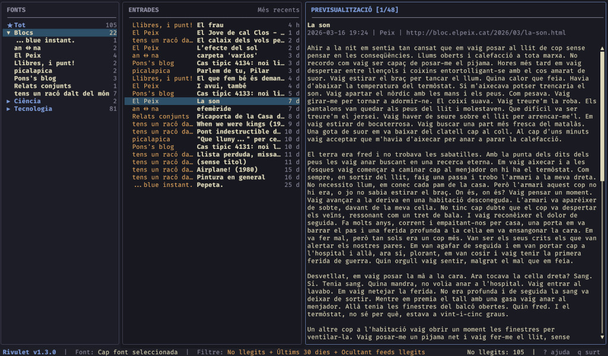

# Rivulet

A terminal RSS reader built with Rust and [ratatui](https://github.com/ratatui-org/ratatui).




## Features

- **Dual layout** — 3-column (Feeds | Entries | Preview) or 2-column split mode, toggle with `w`
- **Feed categories** — Group feeds by topic with collapsible sections
- **Rich HTML preview** — Bold, italic, links, code blocks, lists
- **Panel search** — Context-aware `/` search: filter feeds by name, search entries in DB, highlight matches in preview with `n`/`N` navigation
- **Smart filtering** — Unread, saved, configurable time filter, hide read feeds
- **Multi-select** — Select multiple entries with Space, then bulk mark read or save
- **Entry sorting** — By date (newest/oldest first) or title A-Z
- **Mouse support** — Click to select, scroll to navigate
- **Mark read** — Mark individual entries, all visible, or entire feed as read
- **Feed renaming** — Custom names with ability to restore the original
- **Save for later** — Bookmark entries with `s`, filter saved with `b`
- **Feed auto-discovery** — Paste a website URL and Rivulet finds the RSS/Atom feed automatically
- **OPML import/export** — Migrate feeds from/to other RSS readers
- **Auto-refresh** — Configurable periodic refresh (default: 30 min)
- **Themes** — Terminal-adaptive (default), dark, light, and custom themes
- **i18n** — English and Catalan
- **Local SQLite storage** — No external services required

## Install

```sh
cargo install rivulet-reader
```

Or from source:

```sh
cargo install --path .
```

Requires Rust 2024 edition (1.85+).

## Usage

```sh
rivulet
```

Press `a` to add a feed. You can paste either a direct feed URL or a website URL — Rivulet will auto-discover the feed. Press `r` to refresh all feeds.

### OPML import/export

Import feeds from another RSS reader:

```sh
rivulet import subscriptions.opml
```

Export your feeds:

```sh
rivulet export subscriptions.opml   # to file
rivulet export                      # to stdout
```

Categories are preserved during import and export.

### Key bindings

| Key                 | Action                                                    |
| ------------------- | --------------------------------------------------------- |
| **Navigation**      |                                                           |
| `Left` / `Right`    | Previous / next panel                                     |
| `1` / `2` / `3`     | Jump to Feeds / Entries / Preview                         |
| `Up` / `Down`       | Move selection                                            |
| `PgUp` / `PgDn`     | Scroll preview                                            |
| `Home` / `End`      | Top / bottom (also `g` / `G`)                             |
| `H` / `L`           | Resize focused panel                                      |
| `w`                 | Toggle layout (columns / split)                           |
| `Enter`             | Select feed / open entry                                  |
| `Space`             | Collapse/expand category (feeds) / select entry (entries) |
| `Esc`               | Back                                                      |
| **Feeds**           |                                                           |
| `a`                 | Add feed                                                  |
| `e`                 | Rename feed                                               |
| `d`                 | Delete feed                                               |
| `r`                 | Refresh all feeds                                         |
| `f`                 | Toggle unread filter                                      |
| `b`                 | Toggle saved filter                                       |
| `c`                 | Assign category                                           |
| `C`                 | Manage categories                                         |
| `R`                 | Mark feed as read                                         |
| `S`                 | Cycle sort mode                                           |
| `i`                 | Feed info (name and URL)                                  |
| `.`                 | Hide/show read feeds                                      |
| `t`                 | Toggle time filter                                        |
| **Entries**         |                                                           |
| `m`                 | Toggle read/unread                                        |
| `M`                 | Mark all visible as read                                  |
| `s`                 | Save for later                                            |
| `r`                 | Refresh selected feed                                     |
| `/`                 | Search (contextual: feeds / entries / preview)            |
| `n` / `N`           | Next / previous search match (preview)                    |
| `o`                 | Open in browser                                           |
| `y`                 | Copy preview to clipboard                                 |
| `x`                 | Clear read entries (when unread filter active)            |
| `F5`                | Reload entries from database                              |
| `Tab` / `Shift+Tab` | Next / previous link in preview                           |
| **General**         |                                                           |
| `?`                 | Help                                                      |
| `q`                 | Quit                                                      |

## Config

```toml
# ~/.config/rivulet/config.toml
language = "en"         # or "ca" for Catalan
refresh_minutes = 30    # auto-refresh interval (0 to disable)
recent_days = 30        # time filter window in days
layout = "columns"      # or "split" for 2-column stacked layout
theme = "terminal"      # "terminal", "dark", "light", or custom name
hide_read_feeds = false  # hide feeds with no unread entries
```

The config file is created automatically on first run.

### Custom themes

Create a TOML file in `~/.config/rivulet/themes/` with all 16 color fields. Colors can be hex (`#RRGGBB`) or named terminal colors (`blue`, `dark_gray`, `reset`, etc.).

```toml
# ~/.config/rivulet/themes/gruvbox.toml
header_bg = "#282828"
border = "#665c54"
focus_border = "#458588"
focus_title = "#ebdbb2"
highlight_bg = "#458588"
highlight_fg = "#ebdbb2"
focus_bg = "#1d2021"
block_bg = "#1d2021"
feeds_bg = "#282828"
preview_bg = "#1d2021"
text = "#ebdbb2"
dim = "#928374"
status_ok = "#98971a"
status_err = "#cc241d"
accent = "#83a598"
accent_alt = "#d79921"
```

Then set `theme = "gruvbox"` in `config.toml`. If the file is missing or has errors, Rivulet falls back to the built-in dark theme.

## License

[GNU General Public License v3.0](LICENSE)
